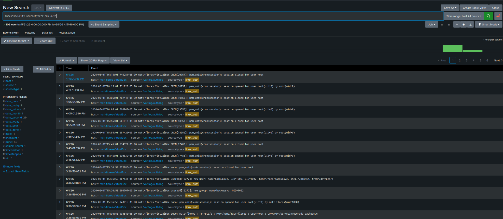
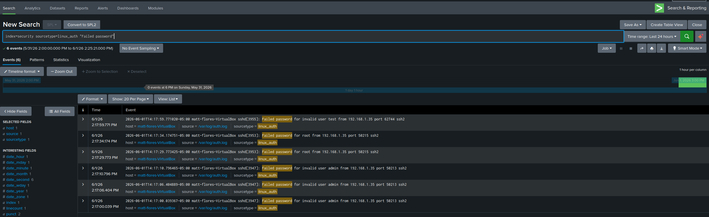
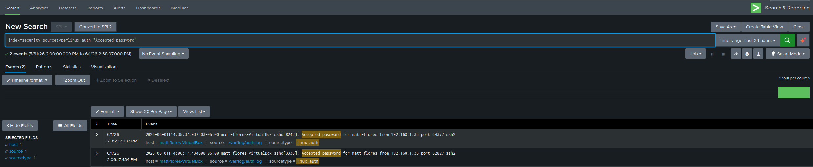
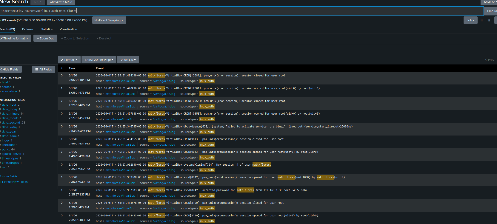
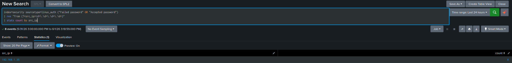
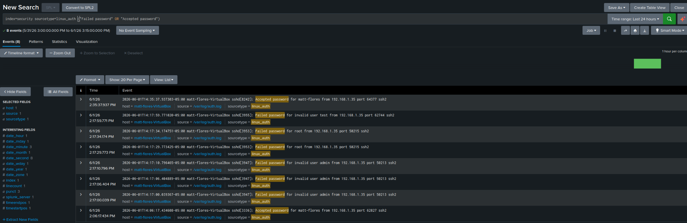
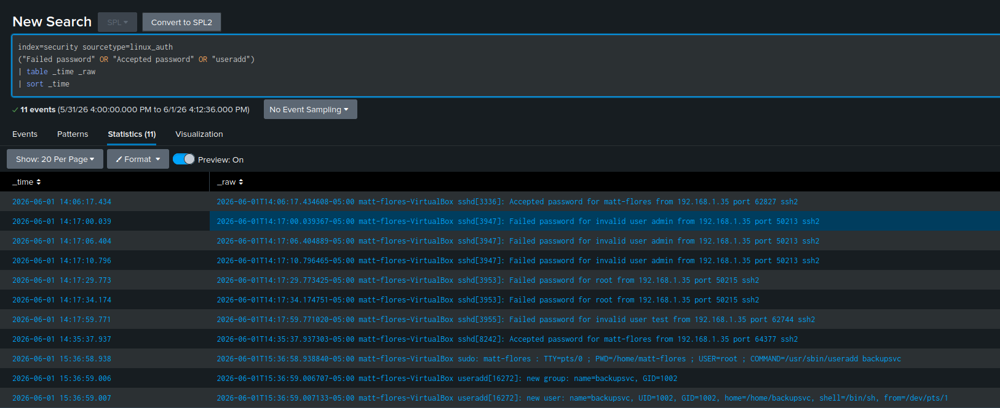
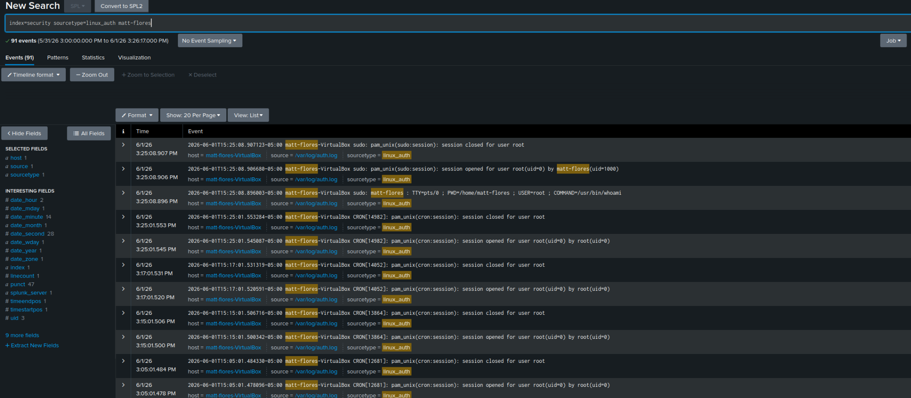
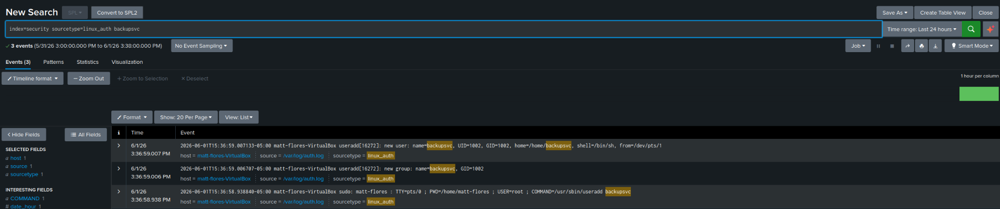

# SOC-Incident-Response-Investigation-Lab

## Project Overview

This project simulates a Security Operations Center (SOC) incident response investigation using Splunk Enterprise and Linux authentication logs. The objective was to investigate suspicious Secure Shell (SSH) activity, reconstruct the attack timeline, identify Indicators of Compromise (IOCs), and document findings through a structured incident response workflow.

The investigation followed a realistic attack progression involving failed authentication attempts, successful access, privileged activity, and local account creation.

---

## Objectives

- Investigate suspicious SSH authentication activity
- Identify failed and successful login attempts
- Attribute activity to a source IP address
- Reconstruct a timeline of attacker behavior
- Identify Indicators of Compromise (IOCs)
- Analyze privilege escalation activity
- Investigate persistence-related behavior
- Produce a professional incident report

---

## Lab Environment

| Component | Details |
|------------|------------|
| Host System | Windows 11 |
| Virtualization | Oracle VirtualBox |
| Guest Operating System | Ubuntu Linux |
| SIEM | Splunk Enterprise |
| Index | security |
| Sourcetype | linux_auth |
| Network Configuration | Bridged Adapter |

---

## Attack Simulation

The following activity was generated to simulate a realistic authentication-related security incident:

- Multiple failed SSH authentication attempts
- Username enumeration against common accounts
- Successful SSH authentication
- Interactive session establishment
- Privileged command execution using `sudo`
- Local account creation for persistence simulation

### Failed SSH Authentication Attempts

### Successful SSH Authentication

### Session Establishment

---

## Investigation Methodology

The investigation was performed using Splunk Search Processing Language (SPL) queries against Linux authentication logs.

Analysis focused on:

- Authentication failures
- Successful authentications
- Session creation events
- Source IP attribution
- Privileged command execution
- Account creation activity
- Timeline reconstruction

### Source IP Attribution

The source IP address responsible for the activity was extracted from authentication logs using regular expression field extraction and statistical analysis.

---

## Timeline Reconstruction

Authentication events were correlated to reconstruct the sequence of activity observed during the investigation.

| Time | Event |
|--------|--------|
| 14:17:00 | Failed SSH login attempt against `admin` |
| 14:17:06 | Failed SSH login attempt against `admin` |
| 14:17:10 | Failed SSH login attempt against `admin` |
| 14:17:29 | Failed SSH login attempt against `root` |
| 14:17:34 | Failed SSH login attempt against `root` |
| 14:17:59 | Failed SSH login attempt against `test` |
| 14:35:37 | Successful SSH authentication for `matt-flores` |
| 15:25:08 | Privileged command executed via `sudo` |
| 15:36:58 | `useradd backupsvc` executed |
| 15:36:59 | `backupsvc` account created |

### Timeline Analysis

---

## Indicator of Compromise (IOC) Analysis

The investigation identified the following indicators associated with the activity.

| IOC Type | Value | Evidence |
|-----------|---------|---------|
| Source IP | `192.168.1.35` | Failed and successful SSH activity |
| Target Accounts | `admin`, `root`, `test` | Failed authentication attempts |
| Authenticated Account | `matt-flores` | Successful SSH login |
| Privileged Command | `sudo whoami` | Root-level command execution |
| Persistence Command | `useradd backupsvc` | Account creation activity |
| Created Account | `backupsvc` | New local user detected |

### IOC Summary

---

## Investigation Findings

### Finding 1: Authentication Activity Progressed Beyond Initial Access Attempts

Multiple failed SSH authentication attempts were observed against common usernames before successful authentication to the `matt-flores` account. This demonstrates progression from authentication probing to successful access.

### Finding 2: Elevated Privileges Were Successfully Obtained

Authentication logs confirmed execution of privileged commands through `sudo`, resulting in root-level command execution and privileged session creation.

### Finding 3: Persistence-Related Activity Was Observed

A new local account (`backupsvc`) was created following successful authentication and privilege escalation activity. Creation of additional accounts is a commonly monitored persistence technique because it can provide continued access to a system.

---

## Severity Assessment

**Severity: Medium**

The investigation identified successful SSH authentication, privileged command execution, and local account creation activity originating from a single source IP address.

While the activity demonstrated access progression and persistence-related behavior, no evidence of malware execution, lateral movement, data exfiltration, or impact to additional systems was identified during the investigation.

---

## Recommendations

1. Investigate repeated SSH authentication failures targeting common usernames.
2. Enforce strong password policies for remote-access accounts.
3. Restrict SSH access to approved IP addresses whenever possible.
4. Monitor privileged commands such as `sudo`, `useradd`, `usermod`, and `passwd`.
5. Review newly created local accounts for legitimacy.
6. Implement Multi-Factor Authentication (MFA) for remote administrative access.

---

## Key Takeaways

This project demonstrated a complete SOC investigation workflow using Splunk and Linux authentication telemetry.

Key skills practiced included:

- Log analysis
- Incident investigation
- Timeline reconstruction
- IOC identification
- Source attribution
- Privilege escalation analysis
- Persistence analysis
- Incident reporting

The investigation successfully reconstructed a realistic attack progression from failed authentication attempts through account creation activity using evidence collected from Linux authentication logs.
